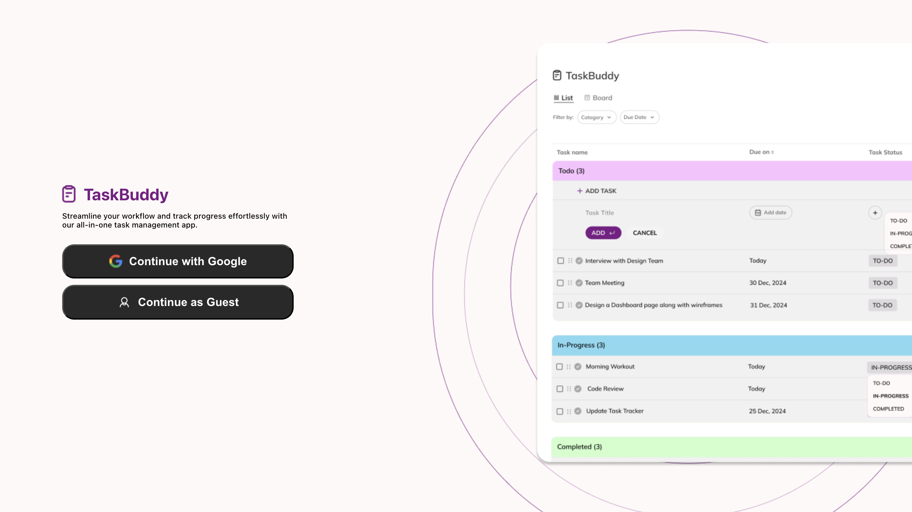
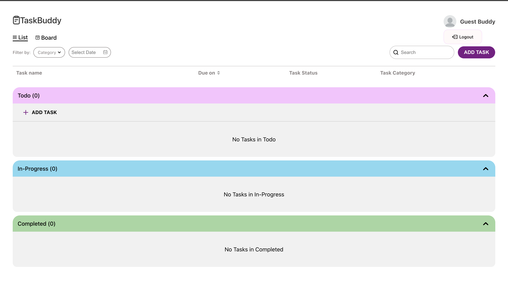
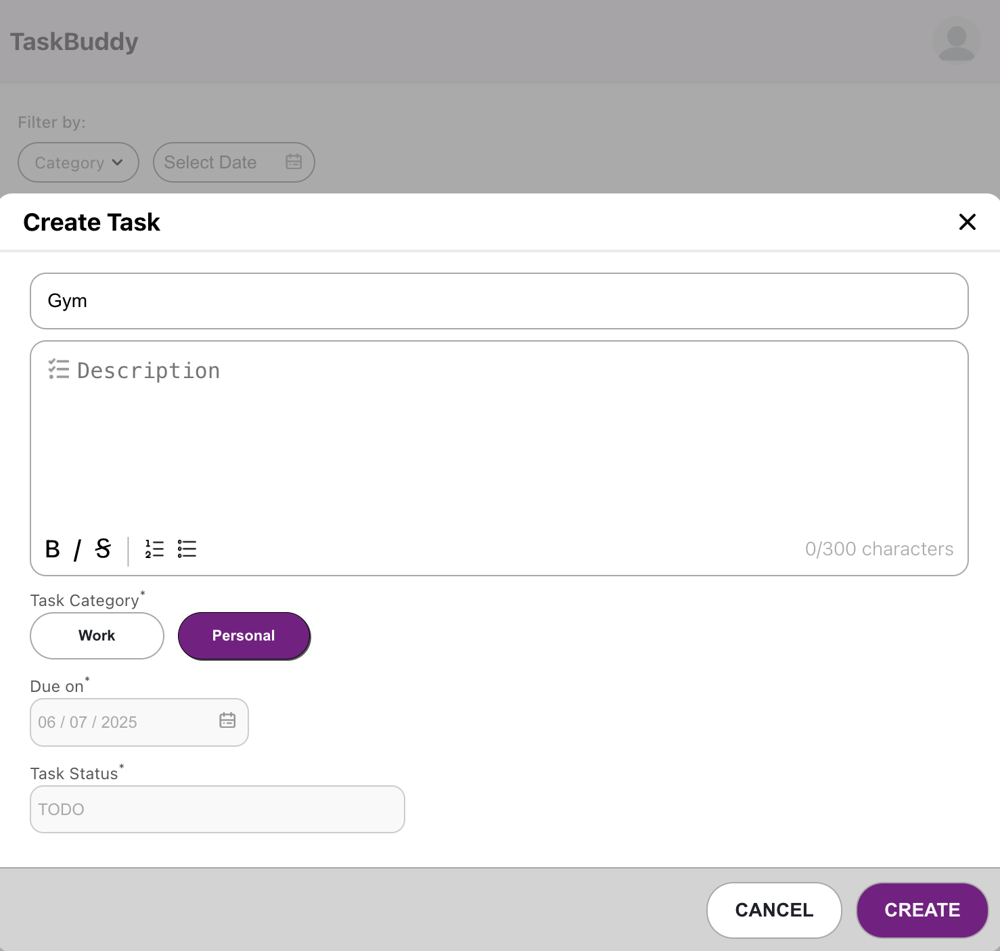
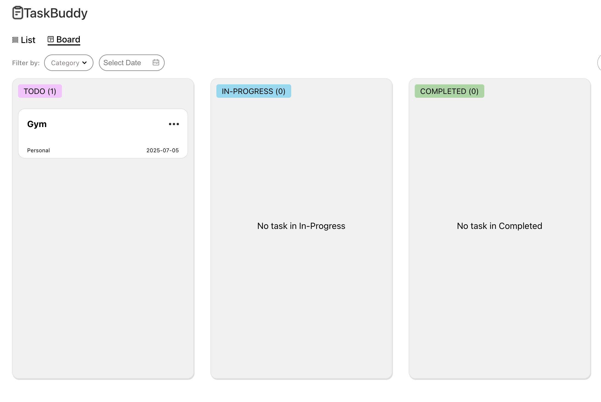

# 📝 TaskBuddy
**TaskBuddy** is a minimalist task management app built with React, Firebase, and Tailwind CSS. It supports secure authentication, guest login, and session persistence using Local Storage, so users stay logged in until they log out.

---

## 🚀 Features

- ✅ Add, update, and delete tasks  
- 🔍 Search tasks easily  
- 🔀 Sort tasks by date or status  
- ↔️ Drag & drop tasks between **To-Do** ,**In-progess** and **Completed** lists  
- 🔒 Firebase Authentication (Email/Password)  
- 🙌 Guest Login — no signup needed  
- 💾 Session persistence with **Local Storage** (auto-login until logout)  
- ☁️ Real-time Firestore sync  
- 💻 Responsive UI with Tailwind CSS  
---

## 🛠 Tech Stack

- **Frontend:** React, Vite, TypeScript, Tailwind CSS  
- **Backend:** Firebase Authentication & Firestore  
- **Storage:** Local Storage (for session persistence)  
- **Deployment:** Vercel  

---

## 🌐 Live Demo

👉 [Try TaskBuddy Now](https://taskbuddy-chi.vercel.app)

> 💡 Use **Guest Login** to test instantly without an account!

---

## 📸 Screenshots

<!-- Replace with your actual images -->
<div>
  
  
  
  
  
</div>
---

## 📦 Installation

```bash
git clone https://github.com/your-username/taskbuddy.git
cd taskbuddy
npm install
npm run dev
